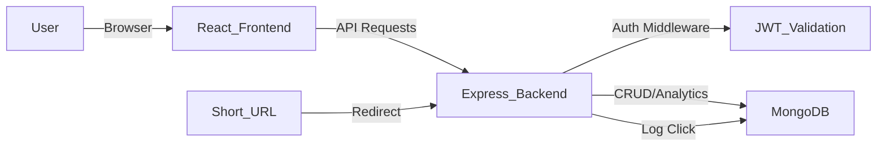

# LinkSwift - URL Shortener with Analytics

A high-performance, full-stack URL shortener built with Node.js, Express, MongoDB, and React. This application provides a seamless experience for creating, managing, and tracking shortened links with real-time analytics.

## 📺 Demo Video
Watch the full application walkthrough on Loom: [LinkSwift Demo Video](https://www.loom.com/share/d426bddc74af453a87cc36a891344a7e)

## 🚀 Features

### Core Features (Mandatory)
- **Authentication**: Secure signup and login with JWT and bcrypt password hashing.
- **Protected Dashboard**: Personalized dashboard for users to manage their own links.
- **URL Shortening**: Generate unique short codes for long URLs with validation.
- **Instant Redirect**: Server-side redirection from short URL to destination.
- **Real-time Analytics**: Tracks total clicks, last visit time, and recent visit history (timestamp, IP, User Agent).
- **Link Management**: Easy dashboard to view all links, copy URLs, and delete entries.
- **Premium UI**: Responsive, dark-themed glassmorphism interface with smooth animations.

### Bonus Features
- **Smart Device Routing**: Links intelligently parse HTTP `User-Agent` headers to redirect users to specialized URLs based on their OS (e.g., iOS users to the App Store, Android to Google Play).
- **Custom Aliases**: Choose your own short link slugs.
- **QR Code Generation**: Instantly generate QR codes for any shortened link.
- **Link Expiry**: Set expiration dates for temporary links.
- **Click Trend Charts**: Visual representation of daily click frequency using Recharts.
- **Edit Destination**: Ability to update the original URL for an existing short code.

## 🛠️ Tech Stack
- **Frontend**: React 18, Vite, React Router, Recharts, Lucide-React, React Hot Toast, QRCode.react.
- **Backend**: Node.js, Express.js.
- **Database**: MongoDB (Mongoose ODM).
- **Auth**: JSON Web Tokens (JWT), BcryptJS.

## ⚙️ Setup Instructions

### Prerequisites
- Node.js installed
- MongoDB installed and running (or a MongoDB Atlas URI)

### Backend Setup
1. Navigate to the `server` directory:
   ```bash
   cd server
   ```
2. Install dependencies:
   ```bash
   npm install
   ```
3. Create a `.env` file in the `server` directory (refer to `.env.example` or use the one provided):
   ```env
   PORT=5000
   MONGODB_URI=mongodb://localhost:27017/url_shortener
   JWT_SECRET=your_jwt_secret_here
   BASE_URL=http://localhost:5000
   ```
4. Start the server:
   ```bash
   npm start
   ```

### Frontend Setup
1. Navigate to the `client` directory:
   ```bash
   cd client
   ```
2. Install dependencies:
   ```bash
   npm install
   ```
3. Start the development server:
   ```bash
   npm run dev
   ```
4. Open your browser at `http://localhost:3000`.

## 🏗️ Architecture Diagram


## 📝 Assumptions
- The application is intended for local development; for production, CORS and Helmet should be strictly configured.
- Short codes are 6 characters long by default using `nanoid`.

---
This project is a part of a hackathon run by https://katomaran.com
